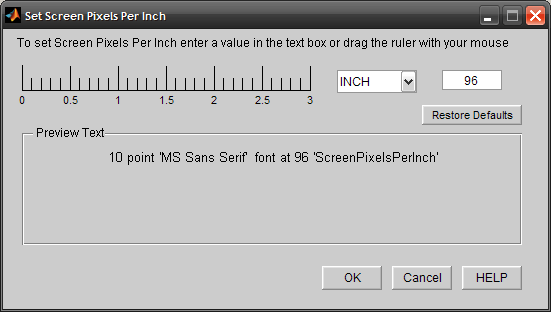

# MATLAB : UISetScreenPixelsPerInch
**UISetScreenPixelsPerInch.m is a MATLAB UI for interactively setting the Root ScreenPixelsPerInchProperty**

**NOTE: This tool works only in releases prior to MATLAB R2015b (8.6)**

This is the actual submission: 
http://www.mathworks.com/matlabcentral/fileexchange/25980-uisetscreenpixelsperinch



```matlab
%UISETSCREENPIXELSPERINCH set the Root Property: 'ScreenPixelsPerInch'
%   UISETSCREENPIXELSPERINCH() launches a GUI that can be used
%   to visualize the effects of changing the root property
%   'ScreenPixelsPerInch' prior to actually setting its value.
%   The 'Text in MATLAB Figures' can be made to appear larger or smaller
%   by changing the value of the ScreenPixelsPerInch root property.
%
%   All the input parameters are optional.
%
%   The dialog box, helps in doing one of the following:
%      To increase the size of text and other items on MATLAB figures, 
%      – Using 120 PPI makes text more readable, and then click OK.
%      To decrease the size of text and other items on MATLAB figures, 
%      – Using 72 PPI will help fit more information on the text, and then click OK.
%      Or use a Custom Setting(recommended values would be 72,96 & 120).
%
%   UISETSCREENPIXELSPERINCH(ScreenPixelsPerInch_Value) will set the
%   value of the root property to the one specified as the input argument.
%
%
%   Example:
%           uisetscreenpixelsperinch()
%           uisetscreenpixelsperinch(120) % Set value to 120
%           uisetscreenpixelsperinch('reset') % Restores system defaults
%
%   See also text, axes, figure, uisetfont, uisetcolor

%   Copyright 1984-2009 The MathWorks, Inc.
%   Written 06/15/2009
```

